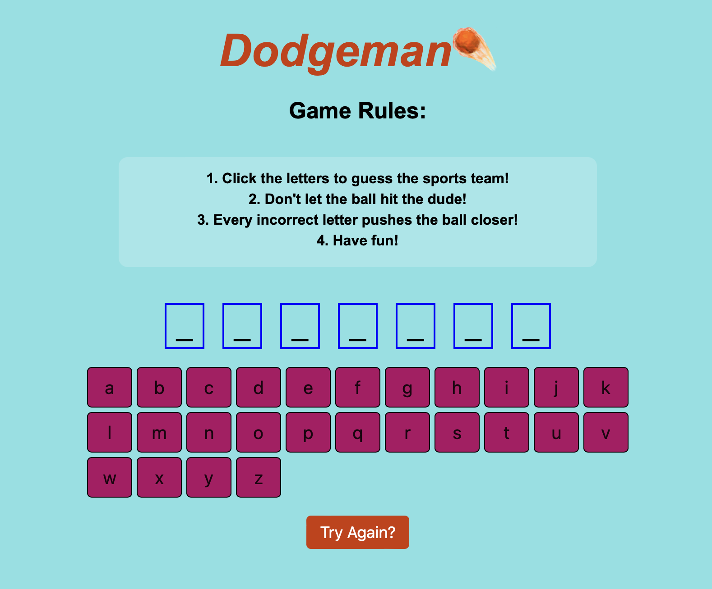

# *Dodgeman☄️*

## Game Description

Dodgeman☄️ is an interactive word-guessing game where players must correctly guess a hidden sports team name. Each incorrect guess brings a dodgeball closer to hitting the character. The objective is to guess the word before the dodgeball reaches the character's face.

## Background Information

The inspiration for this game came from classic hangman-style word games but with a fun and dynamic visual twist. By incorporating the dodgeball element, players get a more immersive and engaging experience.

## Getting Started

[PLAY THE GAME](https://abashwitharash.github.io/Dodgeman/)

### Instructions

1. Click the letters to guess the sports team.

2. Every incorrect letter pushes the dodgeball closer.

3. If the dodgeball reaches the character's face, you lose!

4. Try to guess the word before the ball reaches the final stage.

5. Press 'Try Again?' to restart the game.

Attributions

* [GOOGLE](www.google.com)

* [MDN](https://developer.mozilla.org/en-US/)

* [GOOGLE FONTS](https://fonts.google.com)

* [ACCESS SCAN](https://accessibe.com/accessscan?website=https://abashwitharash.github.io/Dodgeman/&gclid=CjwKCAiA2JG9BhAuEiwAH_zf3gTDhMz0ZPixSm73Iv73LxjaMr4s_EBS9etrxMz7IvZR8nTFejCUaxoCXlEQAvD_BwE)

## Technologies Used

* HTML

* CSS

* JavaScript

## Next Steps

> Implement additional word categories

>>Add sound effects for correct/incorrect guesses

>>>Introduce different difficulty levels

>>>>Improve UI animations for better user experience

>>>>>Add a hint

